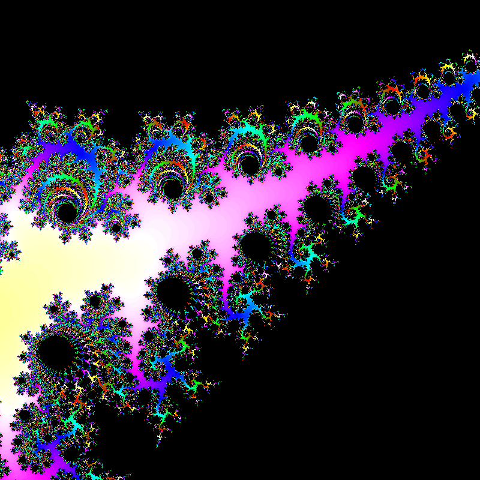

# Mandelbrot-Set  

   W/A/S/D    -   move up/right/down/left  
   Up/Down    -   zoom in/out  
   Left/Right -   decrease/increase iterationlimit  
   R          -   switch between CPU and GPU computation (GPU is faster but lower precision, CPU is single threaded)  
   Enter      -   save to file (only in CPU mode)  

